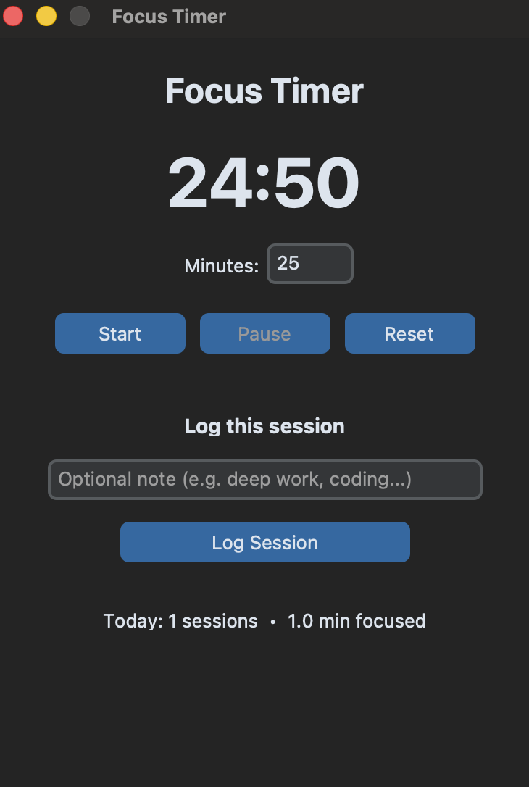

# Focus Timer

A simple and clean Pomodoro-style focus timer with session logging, built with Python and CustomTkinter.


## Features

- Clean dark-mode interface
- Customizable focus duration
- Start / Pause / Reset controls
- One-click session logging with optional notes
- Tracks number of sessions and total focused time for today
- Data is saved locally in JSON format

## Screenshots



## Requirements

- Python 3.10 or higher
- macOS (tested on Apple Silicon)
- CustomTkinter

## Installation (macOS)

1. Clone the repository:
   ```bash
   git clone https://github.com/andyapdevelopment/focus-timer.git
   cd focus-timer
   ```

2. Create and activate a virtual environment:
   ```bash
   python3 -m venv venv
   source venv/bin/activate
   ```

3. Install dependencies:
   ```bash
   pip install -r requirements.txt
   ```

> **Note for macOS users:**  
> If you get a `_tkinter` error, install Tk support with:
> ```bash
> brew install python-tk@3.14
> ```
> (Replace `3.14` with your Python version if different)

## Usage

Run the application:

```bash
python main.py
```

### How to use
1. Set the desired focus time in minutes (default is 25)
2. Click **Start** to begin the timer
3. Use **Pause** or **Reset** as needed
4. When finished, optionally add a note and click **Log Session**
5. Your daily stats will update automatically

## Project Structure

```
focus-timer/
├── main.py              # Entry point
├── requirements.txt
├── core/
│   ├── timer.py         # Timer logic
│   └── logger.py        # Session logging
├── ui/
│   └── app.py           # GUI
└── data/                # Created automatically (stores sessions.json)
```

## Future Ideas

- Sound notification when timer ends
- Session history view
- Light / Dark mode toggle
- Export sessions to CSV
- Package as a standalone macOS `.app`

## License

MIT
